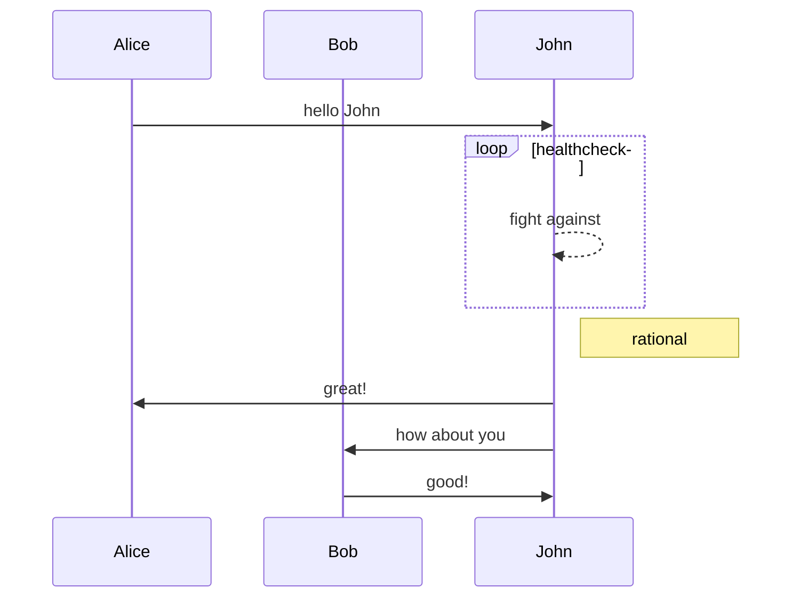

# 我是一个记笔记的工具

特别的方便

**我可以加粗**

*也可以倾斜*

***加粗和倾斜***

~~删除线也可以~~

- [ ] 也可加一个复选框

- [x] 复选框可以手动选中

&emsp;&emsp;这是我一个一个**平白无奇**的故事，我帮助很多人快速的记录了灵感，让他们有一个**快速整洁**的排版。

## 二级标题

### 三级标题

- 无序列表
  - 二级无序
    - 三级无序

我也可以做有序列表

1. 一级有序
   1. 二级有序
2. 一级有序2

是不是很整齐呢？

#### 这只是一点点的功能， 听我慢慢道来

我可以添加链接

[百度](www.baidu.com)

[必应](www.cn.bing.com)

也可以添加图片


快速和方便是我的宗旨

表格是很常用的，有没有表格呢？of course

| 表头 | 表头 | 表头 |
| :--: | :--: | :--: |
| 内容 | 内容 | 内容 |
| 内容 | 内容 | 内容 |
|      |      |      |
|      |      |      |

还可以增加脚注[^1]


[^1]:我是第一条脚注；


漂亮的流程图

```flow
st=>start: 开始
op=>operation: My Operation
cond=>condition: Yes or No?
e=>end
st->op->cond
cond(yes)->e
cond(no)->op
```

公式也可以的

```mermaid
graph LR;
　　client---core;
　　client---common;
　　core---common;
　　common---portal;
　　common---Biz;
　　Biz---ConfigService;
　　Biz---AdminService;
​```
```




